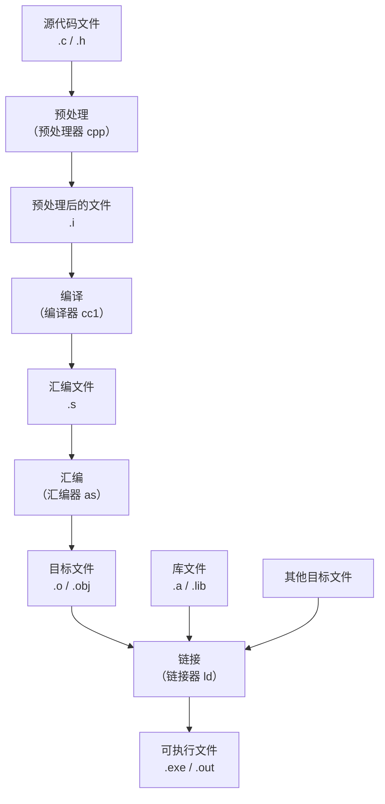

## C语言程序生成的原理
作为古老的编程语言之一，C的设计也是比较原始的，也比较简单

每个C语言源码都以以下拓展名结尾：
- c：定义一个目标文件的源码
- h：定义可被重复包含的源码
对于各种集成开发环境（IDE）可能还会有自己的项目管理文件，这里不展开讨论

对于源码将会大致经过以下步骤编译为最终文件




从源码到目标文件都是在编译器里完成的，而从目标文件到最终的可执行文件则是通过连接器完成，通常这一过程将会在连接器里完成，现代的编译器普遍可能会帮你完成最终的连接，这里我们大部分时间只讨论最简单的情况：从单一源码到单一的可执行文件


## C语言程序结构

对于基本的C语言程序包含以下部分：

```c
#include<stdio.h>

int main()
{
	/*This Is A Commit*/
	printf("Ciallo World");
	
	return 0;
}
```


- 行1：`#include<stdio.h>`：预处理器指令，将在预处理阶段执行并且给出最终的代码
- 行3：`int main()`：函数声明，这一行下面中括号中都属于函数体，每个C语言程序都是由若干函数构成的
- 行5：`/*This Is A Commit*/`：注释，起标注作用，编译器在预处理阶段将会将其去除
- 行6：一条语句：一个函数实际上要执行的内容，最后的return语句将会终止这个函数的执行
其余的结构还有：变量，用于存储函数在执行的时候需要的量

将上文的程序保存为`main.c`并且执行以下命令你将会得到：
```shell
$ gcc main.c
$ ./a.out
Ciallo World
```
或者点击IDE中的编译并执行的按钮你也能看到一样的结果


