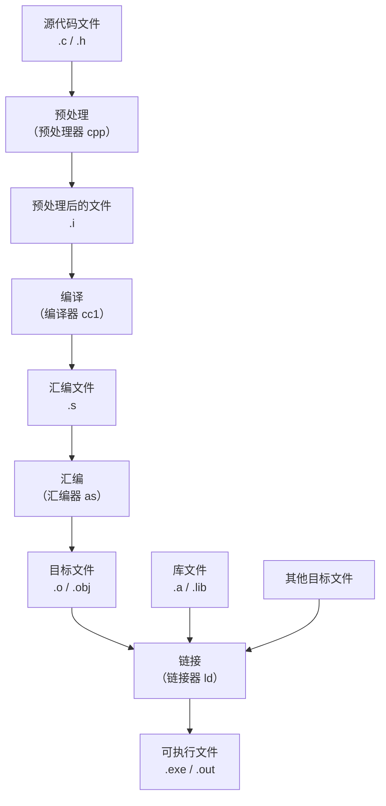

## C语言程序生成的原理

作为古老的编程语言之一，C的设计也是比较原始的，也比较简单

每个C语言源码都以以下拓展名结尾：

- `.c`：定义一个目标文件的源码
- `.h`：定义可被重复包含的源码（头文件）

对于各种集成开发环境（IDE）可能还会有自己的项目管理文件，这里不展开讨论

对于源码将会大致经过以下步骤编译为最终文件



### 各阶段详解

**1. 预处理（Preprocessing）**

- 处理 `#include`、`#define` 等预处理指令
- 展开宏定义
- 删除注释
- 生成 `.i` 文件

**2. 编译（Compilation）**

- 语法分析、语义分析
- 生成中间代码
- 优化代码
- 生成汇编代码（`.s` 文件）

**3. 汇编（Assembly）**

- 将汇编代码转换为机器码
- 生成目标文件（`.o` 或 `.obj`）

**4. 链接（Linking）**

- 合并多个目标文件
- 解析符号引用
- 链接库文件
- 生成最终可执行文件

从源码到目标文件都是在编译器里完成的，而从目标文件到最终的可执行文件则是通过链接器完成，通常这一过程将会在链接器里完成，现代的编译器普遍可能会帮你完成最终的链接，这里我们大部分时间只讨论最简单的情况：从单一源码到单一的可执行文件

## C语言程序结构

对于基本的C语言程序包含以下部分：

```c
#include<stdio.h>

int main()
{
	/*This Is A Comment*/
	printf("Ciallo World");

	return 0;
}
```

- 行1：`#include<stdio.h>`：预处理器指令，将在预处理阶段执行并且展开成实际的代码
- 行3：`int main()`：主函数声明，程序入口，每个C程序必须有一个main函数
- 行4-7：函数体，用花括号包围
- 行5：`/*This Is A Comment*/`：注释，编译器在预处理阶段将会将其去除
- 行6：`printf("Ciallo World");`：输出语句，以分号结尾，表示一条完整的语句
- 行7：`return 0;`：返回值，表示程序正常结束

将上文的程序保存为`main.c`并且执行以下命令你将会得到：

```shell
$ gcc main.c
$ ./a.out
Ciallo World
```

或者点击IDE中的编译并执行的按钮你也能看到一样的结果

## 数据类型

C语言中数据类型分为以下几类：

### 基本数据类型

| 类型     | 说明       | 典型大小 | 取值范围                       |
| -------- | ---------- | -------- | ------------------------------ |
| `char`   | 字符型     | 1字节    | -128 ~ 127 或 0 ~ 255          |
| `int`    | 整型       | 4字节    | -2,147,483,648 ~ 2,147,483,647 |
| `float`  | 单精度浮点 | 4字节    | ±3.4e±38                       |
| `double` | 双精度浮点 | 8字节    | ±1.7e±308                      |
| `void`   | 空类型     | 0字节    | 无                             |

### 类型修饰符

- `short` / `long`：缩短或延长长度
- `signed` / `unsigned`：有符号或无符号

```c
short int si;           // 短整型，通常2字节
long int li;            // 长整型，通常4或8字节
long long int lli;      // 更长的整型，8字节
unsigned int ui;        // 无符号整型，0 ~ 4,294,967,295
unsigned char uc;       // 无符号字符型，0 ~ 255
signed int si;          // 有符号整型，默认
```

**各类型大小示例：**

```c
#include <stdio.h>

int main() {
    printf("char: %zu 字节\n", sizeof(char));
    printf("int: %zu 字节\n", sizeof(int));
    printf("float: %zu 字节\n", sizeof(float));
    printf("double: %zu 字节\n", sizeof(double));
    printf("short: %zu 字节\n", sizeof(short));
    printf("long: %zu 字节\n", sizeof(long));
    printf("long long: %zu 字节\n", sizeof(long long));
    return 0;
}
```

### 派生类型

- **数组**：相同类型元素的集合
- **指针**：存储地址的变量
- **结构体**：不同类型数据的组合
- **共用体**：共享同一段内存
- **函数**：可重复调用的代码块

## 变量与常量

### 变量

变量使用前必须先声明，声明时指定类型：

```c
int age;           // 声明一个整型变量
age = 20;          // 赋值

int count = 10;    // 声明时同时初始化

// 同时声明多个同类型变量
int a, b, c;
int x = 1, y = 2, z = 3;
```

**变量命名规则：**

- 由字母、数字、下划线组成
- 只能以字母或下划线开头
- 区分大小写
- 不能使用C语言关键字

**变量的作用域：**

```c
#include <stdio.h>

int global_var = 100;  // 全局变量，在整个文件中可见

void test() {
    printf("全局变量: %d\n", global_var);
}

int main() {
    int local_var = 50;  // 局部变量，只在main函数内可见

    printf("局部变量: %d\n", local_var);
    test();

    return 0;
}
```

### 常量

常量是不可修改的值：

**1. const 关键字：**

```c
const int MAX_SIZE = 100;
const char NEWLINE = '\n';

// const 修饰指针时位置不同意义不同
const int *p1;      // 指向常量整数的指针，不能通过p1修改值
int const *p2;      // 同上
int * const p3;     // 常量指针，指针本身不能修改
const int * const p4;  // 指向常量的常量指针，两者都不能修改
```

**2. 宏定义（#define）：**

```c
#define MAX_SIZE 100
#define PI 3.14159
#define MESSAGE "Hello World"
#define PRINT printf("Hello\n")
```

**3. 枚举常量：**

```c
enum Color {
    RED = 0,    // 默认从0开始
    GREEN,
    BLUE
};

enum Day {
    MON = 1,
    TUE,
    WED,
    THU,
    FRI,
    SAT,
    SUN
};
```

## 运算符

### 算术运算符

```c
int a = 10, b = 3;

int sum = a + b;      // 13，加
int diff = a - b;     // 7，减
int prod = a * b;     // 30，乘
int quot = a / b;     // 3，整数除法
int rem = a % b;      // 1，取余

a++;                  // 后置自增，先使用值再增加
++a;                  // 前置自增，先增加再使用值
b--;                  // 后置自减
--b;                  // 前置自减
```

**注意：** 整数除法只返回整数部分，如 `10/3 = 3`

### 赋值运算符

```c
int a = 10;

a += 5;   // a = a + 5，即 a = 15
a -= 5;   // a = a - 5
a *= 5;   // a = a * 5
a /= 5;   // a = a / 5
a %= 5;   // a = a % 5
```

### 关系运算符

关系运算符返回真（1）或假（0）：

```c
int a = 10, b = 20;

int r1 = (a == b);    // 0，假
int r2 = (a != b);    // 1，真
int r3 = (a > b);     // 0，假
int r4 = (a < b);     // 1，真
int r5 = (a >= b);    // 0，假
int r6 = (a <= b);    // 1，真
```

### 逻辑运算符

```c
int a = 1, b = 0;

int r1 = (a && b);    // 0，逻辑与：两边都为真才为真
int r2 = (a || b);    // 1，逻辑或：至少一边为真就为真
int r3 = !a;          // 0，逻辑非：真变假，假变真
```

**短路特性：**

- `&&`：左边为假时，右边不计算
- `||`：左边为真时，右边不计算

### 位运算符

位运算符直接操作二进制位：

```c
unsigned int a = 5;   // 二进制：0101
unsigned int b = 3;   // 二进制：0011

unsigned int r1 = a & b;   // 0001 = 1，按位与
unsigned int r2 = a | b;   // 0111 = 7，按位或
unsigned int r3 = a ^ b;   // 0110 = 6，按位异或
unsigned int r4 = ~a;      // 按位取反
unsigned int r5 = a << 2;  // 010100 = 20，左移2位
unsigned int r6 = a >> 2;  // 0001 = 1，右移2位
```

### 条件运算符

唯一的三目运算符：

```c
int a = 10, b = 20;

// 语法：条件 ? 值1 : 值2
int max = (a > b) ? a : b;  // a > b 为假，返回 b，即 20

// 等价于：
int max;
if (a > b) {
    max = a;
} else {
    max = b;
}
```

### 运算符优先级

从高到低（部分）：

| 优先级 | 运算符                     |     |     |
| ------ | -------------------------- | --- | --- |
| 1      | `()` `[]` `->` `.`         |     |     |
| 2      | `!` `~` `++` `--` (类型)   |     |     |
| 3      | `*` `/` `%`                |     |     |
| 4      | `+` `-`                    |     |     |
| 5      | `<<` `>>`                  |     |     |
| 6      | `<` `<=` `>` `>=`          |     |     |
| 7      | `==` `!=`                  |     |     |
| 8      | `&`                        |     |     |
| 9      | `^`                        |     |     |
| 10     | `                          | `   |     |
| 11     | `&&`                       |     |     |
| 12     | `                          |     | `   |
| 13     | `?:`                       |     |     |
| 14     | `=` `+=` `-=` `*=` `/=` 等 |     |     |

**建议：** 使用括号明确表达意图，避免依赖优先级记忆

## 控制流

### 条件语句

**if-else 语句：**

```c
int score = 85;

if (score >= 90) {
    printf("优秀\n");
} else if (score >= 80) {
    printf("良好\n");
} else if (score >= 60) {
    printf("及格\n");
} else {
    printf("不及格\n");
}
```

**if 的嵌套：**

```c
int age = 25;
int has_job = 1;

if (age >= 18) {
    if (has_job) {
        printf("成年人且有工作\n");
    } else {
        printf("成年人且无工作\n");
    }
} else {
    printf("未成年\n");
}
```

### 多分支选择

**switch 语句：**

```c
int day = 3;

switch (day) {
    case 1:
        printf("星期一\n");
        break;
    case 2:
        printf("星期二\n");
        break;
    case 3:
        printf("星期三\n");
        break;
    case 4:
        printf("星期四\n");
        break;
    case 5:
        printf("星期五\n");
        break;
    case 6:
    case 7:
        printf("周末\n");
        break;
    default:
        printf("无效输入\n");
        break;
}
```

**注意：**

- `break` 关键字用于跳出 switch 语句
- 省略 `break` 会导致 case 穿透
- `default` 可选，处理未匹配的情况

### 循环

**for 循环：**

```c
// 语法：for (初始化; 条件; 更新)
for (int i = 0; i < 10; i++) {
    printf("%d ", i);  // 输出 0 1 2 3 4 5 6 7 8 9
}

// 计算1到100的和
int sum = 0;
for (int i = 1; i <= 100; i++) {
    sum += i;
}
printf("sum = %d\n", sum);  // 5050
```

**while 循环：**

```c
int count = 0;

while (count < 5) {
    printf("count = %d\n", count);
    count++;
}
```

**do-while 循环：**

```c
int num = 0;

do {
    printf("至少执行一次，num = %d\n", num);
    num++;
} while (num < 5);
```

**循环控制：**

```c
// break：跳出整个循环
for (int i = 0; i < 10; i++) {
    if (i == 5) {
        break;  // 当 i 等于 5 时跳出循环
    }
    printf("%d ", i);  // 输出 0 1 2 3 4
}

// continue：跳过本次循环，继续下一次
for (int i = 0; i < 10; i++) {
    if (i % 2 == 0) {
        continue;  // 跳过偶数
    }
    printf("%d ", i);  // 输出 1 3 5 7 9
}
```

**多层循环与标签：**

```c
// 使用 goto 跳出多层循环（不推荐过度使用）
for (int i = 0; i < 3; i++) {
    for (int j = 0; j < 3; j++) {
        if (i == 1 && j == 1) {
            goto end;  // 跳转到 end 标签处
        }
        printf("(%d,%d) ", i, j);
    }
}
end:
printf("\n跳出多层循环\n");
```

## 函数

函数是组织代码的基本单位，实现代码复用：

### 函数定义与调用

```c
// 函数声明（可省略，如果函数定义在调用之前）
int add(int a, int b);

// 函数定义
int add(int a, int b) {
    return a + b;
}

int main() {
    int result = add(3, 5);  // 调用函数
    printf("3 + 5 = %d\n", result);  // 8
    return 0;
}
```

### 函数返回值

```c
// 返回整型
int getMax(int a, int b) {
    if (a > b) {
        return a;
    } else {
        return b;
    }
}

// 返回浮点型
double circleArea(double radius) {
    return 3.14159 * radius * radius;
}

// 返回字符型
char getGrade(int score) {
    if (score >= 90) return 'A';
    else if (score >= 80) return 'B';
    else if (score >= 60) return 'C';
    else return 'D';
}

// 无返回值（void）
void printHello() {
    printf("Hello World!\n");
    // return; 可省略
}
```

### 函数参数传递

**1. 值传递：**

```c
void modify(int x) {
    x = 100;  // 只修改副本，原变量不变
}

int main() {
    int num = 10;
    modify(num);
    printf("%d\n", num);  // 仍然是 10
    return 0;
}
```

**2. 指针传递：**

```c
void modify(int *x) {
    *x = 100;  // 通过指针修改原变量
}

int main() {
    int num = 10;
    modify(&num);
    printf("%d\n", num);  // 变成 100
    return 0;
}
```

**3. 数组传递：**

```c
// 数组作为参数
void printArray(int arr[], int len) {
    for (int i = 0; i < len; i++) {
        printf("%d ", arr[i]);
    }
    printf("\n");
}

int main() {
    int nums[] = {1, 2, 3, 4, 5};
    printArray(nums, 5);  // 1 2 3 4 5
    return 0;
}
```

### 递归函数

函数调用自身：

```c
// 计算阶乘
int factorial(int n) {
    if (n <= 1) {
        return 1;
    }
    return n * factorial(n - 1);
}

// 斐波那契数列
int fibonacci(int n) {
    if (n <= 1) {
        return n;
    }
    return fibonacci(n - 1) + fibonacci(n - 2);
}
```

### 局部变量与全局变量

```c
int global = 10;  // 全局变量

void func1() {
    int local = 20;  // 局部变量
    global = 100;    // 可以访问全局变量
    // local 只在 func1 内有效
}

void func2() {
    // local 在这里不可见
    printf("global = %d\n", global);
}
```

## 数组

相同类型数据的集合：

### 一维数组

```c
// 声明和初始化
int numbers[5];              // 声明一个长度为5的数组
int numbers[5] = {1, 2, 3, 4, 5};  // 声明并初始化
int numbers[] = {1, 2, 3, 4, 5};   // 自动推断长度

// 访问元素（下标从0开始）
int first = numbers[0];    // 1
int third = numbers[2];    // 3

// 修改元素
numbers[0] = 10;

// 遍历数组
for (int i = 0; i < 5; i++) {
    printf("%d ", numbers[i]);
}
```

**注意：** 数组下标越界是常见错误，C语言不会检查数组边界

### 字符串（字符数组）

```c
// 字符串以 '\0' 结尾
char str1[] = "Hello";       // 自动添加 '\0'，实际大小为6
char str2[10] = "Hello";     // 前5个字符为 Hello，后4个为 '\0'

// 常见字符串操作
#include <string.h>

char str[20] = "Hello";

// 字符串长度（不包括 '\0'）
int len = strlen(str);  // 5

// 字符串复制
strcpy(str, "World");   // str 变成 "World"

// 字符串连接
strcat(str, "!");       // str 变成 "World!"

// 字符串比较
int cmp = strcmp("abc", "abc");  // 0，相等
```

### 二维数组

```c
// 声明和初始化
int matrix[3][3] = {
    {1, 2, 3},
    {4, 5, 6},
    {7, 8, 9}
};

// 等价于
int matrix[3][3] = {1, 2, 3, 4, 5, 6, 7, 8, 9};

// 访问元素
int element = matrix[1][2];  // 6（第二行第三列）

// 遍历二维数组
for (int i = 0; i < 3; i++) {
    for (int j = 0; j < 3; j++) {
        printf("%d ", matrix[i][j]);
    }
    printf("\n");
}
```

### 数组作为函数参数

```c
// 计算数组元素和
int sumArray(int arr[], int len) {
    int sum = 0;
    for (int i = 0; i < len; i++) {
        sum += arr[i];
    }
    return sum;
}

// 寻找最大值
int maxArray(int arr[], int len) {
    int max = arr[0];
    for (int i = 1; i < len; i++) {
        if (arr[i] > max) {
            max = arr[i];
        }
    }
    return max;
}
```

## 指针

指针是C语言的精髓，直接操作内存：

### 指针基础

```c
int value = 10;
int *ptr = &value;    // ptr 存储 value 的地址，& 是取地址运算符

// 访问指针指向的值
printf("value = %d\n", value);   // 10
printf("ptr = %p\n", ptr);       // value 的地址
printf("*ptr = %d\n", *ptr);     // 10，通过解引用访问值
```

### 指针类型

```c
int i = 10;
double d = 3.14;
char c = 'A';

int *pi = &i;
double *pd = &d;
char *pc = &c;

// 不同类型的指针解引用时解释内存的方式不同
*pi = 20;    // 写入4字节
*pd = 2.71;  // 写入8字节
*pc = 'B';   // 写入1字节
```

### void 指针

```c
void *ptr;  // 通用指针，可以指向任何类型

int num = 100;
ptr = &num;

// 使用时需要强制类型转换
printf("%d\n", *(int *)ptr);
```

### 指针运算

```c
int arr[5] = {10, 20, 30, 40, 50};
int *p = arr;     // 数组名就是首元素地址

// 指针加减整数
p = p + 2;        // 指向 arr[2]，即 30
printf("%d\n", *p);  // 30

// 指针自增
p++;              // 指向 arr[3]，即 40

// 指针相减（同一数组中）
int *p1 = &arr[0];
int *p2 = &arr[3];
ptrdiff_t diff = p2 - p1;  // 3，元素个数差
```

### 指针与数组

```c
int arr[5] = {1, 2, 3, 4, 5};
int *p = arr;

// 两种访问方式等价
for (int i = 0; i < 5; i++) {
    printf("%d ", *(p + i));  // 指针算术
    printf("%d ", p[i]);      // 数组下标
}
```

### 指针数组与数组指针

```c
// 指针数组：数组的元素是指针
int *arr[3];
int a = 1, b = 2, c = 3;
arr[0] = &a;
arr[1] = &b;
arr[2] = &c;

// 数组指针：指向数组的指针
int (*p)[5];  // p 是一个指针，指向包含5个int的数组
int arr[5] = {1, 2, 3, 4, 5};
p = &arr;
```

### 函数指针

```c
int add(int a, int b) {
    return a + b;
}

int main() {
    // 定义函数指针
    int (*funcPtr)(int, int) = add;

    // 通过函数指针调用函数
    int result = funcPtr(3, 5);
    printf("%d\n", result);  // 8

    return 0;
}
```

## 结构体

自定义数据类型，组合不同类型的数据：

### 结构体定义与使用

```c
// 定义结构体
struct Person {
    char name[50];
    int age;
    float height;
};

// 使用结构体
struct Person p1;
strcpy(p1.name, "Alice");
p1.age = 20;
p1.height = 1.65;

// 初始化
struct Person p2 = {"Bob", 25, 1.80};

// 访问成员
printf("%s 的年龄是 %d\n", p2.name, p2.age);
```

### typedef

为类型定义别名，简化代码：

```c
// 使用 typedef
typedef struct Person {
    char name[50];
    int age;
    float height;
} Person;

// 使用别名
Person p1 = {"Alice", 20, 1.65};
Person p2 = {"Bob", 25, 1.80};
```

### 结构体数组

```c
// 结构体数组
Person students[3] = {
    {"Alice", 20, 1.65},
    {"Bob", 22, 1.75},
    {"Charlie", 19, 1.70}
};

// 遍历
for (int i = 0; i < 3; i++) {
    printf("%s: %d岁, %.2fm\n",
           students[i].name,
           students[i].age,
           students[i].height);
}
```

### 结构体与指针

```c
Person p = {"Alice", 20, 1.65};
Person *ptr = &p;

// 通过指针访问成员
printf("%s\n", (*ptr).name);
printf("%s\n", ptr->name);  // 箭头运算符，更简洁
```

### 结构体与函数

```c
// 结构体作为函数参数（值传递）
void printPerson(Person p) {
    printf("%s: %d岁\n", p.name, p.age);
}

// 结构体指针作为函数参数（更高效）
void printPersonPtr(Person *p) {
    printf("%s: %d岁\n", p->name, p->age);
}
```

## 共用体（Union）

成员共享同一段内存：

```c
union Data {
    int i;
    float f;
    char c;
};

union Data d;
d.i = 10;
printf("%d\n", d.i);   // 10

d.f = 3.14;
printf("%f\n", d.f);   // 3.14
// 注意：现在 d.i 的值已经改变

d.c = 'A';
printf("%c\n", d.c);   // A
```

**应用场景：** 节省内存，或同一内存解释为不同类型

## 枚举（Enum）

定义一组命名的整型常量：

```c
enum Color {
    RED,     // 0
    GREEN,   // 1
    BLUE     // 2
};

enum Color c = RED;
printf("%d\n", c);  // 0

// 指定值
enum Level {
    LOW = 1,
    MEDIUM = 5,
    HIGH = 10
};
```

## 动态内存管理

C语言中数组大小通常固定，动态内存允许运行时决定大小：

### malloc 与 free

```c
#include <stdlib.h>

// 分配内存
int *arr = (int *)malloc(5 * sizeof(int));

if (arr == NULL) {
    printf("内存分配失败\n");
    return 1;
}

// 使用内存
for (int i = 0; i < 5; i++) {
    arr[i] = i + 1;
}

// 释放内存
free(arr);
arr = NULL;  // 避免悬空指针
```

### calloc

```c
// 分配并初始化为0
int *arr = (int *)calloc(5, sizeof(int));
// 等价于 malloc 后循环 memset 为 0
```

### realloc

```c
// 重新调整内存大小
int *arr = (int *)malloc(5 * sizeof(int));
// ... 使用 arr ...

// 扩展到10个元素
int *new_arr = (int *)realloc(arr, 10 * sizeof(int));

if (new_arr == NULL) {
    printf("内存分配失败\n");
    free(arr);
    return 1;
}

arr = new_arr;
```

## 标准库简介

C语言自带丰富的标准库：

### stdio.h - 输入输出

```c
#include <stdio.h>

// 输出
printf("格式字符串", 参数);
printf("整数: %d, 浮点: %.2f, 字符: %c\n", 10, 3.14, 'A');

// 输入
int num;
scanf("%d", &num);

// 常见格式符
%d  // 有符号十进制整数
%u  // 无符号十进制整数
%x  // 十六进制
%o  // 八进制
%f  // 浮点数
%lf // double 类型
%s  // 字符串
%c  // 字符
%p  // 指针地址
%%  // 输出百分号
```

### stdlib.h - 标准库

```c
#include <stdlib.h>

// 动态内存
malloc(), calloc(), realloc(), free()

// 程序退出
exit(0);        // 正常退出
exit(1);        // 异常退出

// 转换函数
atoi("123");    // 字符串转整数
atof("3.14");   // 字符串转浮点
itoa(123, str, 10);  // 整数转字符串

// 排序
qsort(arr, n, sizeof(int), compare);
```

### string.h - 字符串处理

```c
#include <string.h>

strlen(s);           // 字符串长度
strcpy(dest, src);   // 字符串复制
strcat(dest, src);   // 字符串连接
strcmp(s1, s2);      // 字符串比较
strchr(s, c);        // 查找字符
strstr(s1, s2);      // 查找子串
memset(s, c, n);     // 内存设置
memcpy(dest, src, n);// 内存复制
```

### math.h - 数学函数

```c
#include <math.h>

sqrt(x);       // 平方根
pow(x, y);     // 幂运算
sin(x);        // 正弦（弧度）
cos(x);        // 余弦
tan(x);        // 正切
log(x);        // 自然对数
log10(x);      // 常用对数
ceil(x);       // 向上取整
floor(x);      // 向下取整
fabs(x);       // 绝对值
```

### time.h - 时间日期

```c
#include <time.h>

time_t now = time(NULL);        // 获取当前时间戳
struct tm *info = localtime(&now);  // 转换为本地时间
printf("%d-%02d-%02d\n",
       info->tm_year + 1900,
       info->tm_mon + 1,
       info->tm_mday);
```

## 文件操作

### 打开与关闭文件

```c
#include <stdio.h>

// 打开文件
FILE *fp = fopen("data.txt", "r");  // 读模式
// 模式: r(读), w(写,新建), a(追加), r+(读写), w+(读写新建), a+(读写追加)

if (fp == NULL) {
    printf("文件打开失败\n");
    return 1;
}

// 关闭文件
fclose(fp);
```

### 读写文件

```c
// 写入文件
FILE *fp = fopen("output.txt", "w");
if (fp != NULL) {
    fprintf(fp, "Hello %d\n", 123);
    fputs("World\n", fp);
    fclose(fp);
}

// 读取文件
fp = fopen("output.txt", "r");
if (fp != NULL) {
    char buffer[100];
    while (fgets(buffer, sizeof(buffer), fp) != NULL) {
        printf("%s", buffer);
    }
    fclose(fp);
}
```

## 预处理器

预处理指令在编译前执行：

### #define 宏

```c
// 简单宏
#define PI 3.14159
#define MAX(a, b) ((a) > (b) ? (a) : (b))
#define SQUARE(x) ((x) * (x))

// 条件编译
#ifdef DEBUG
    printf("调试信息\n");
#endif

#ifndef HEADER_H
#define HEADER_H
// 头文件保护
#endif
```

### #include

```c
// 系统头文件
#include <stdio.h>
#include <stdlib.h>

// 本地头文件
#include "myheader.h"
```

## C语言工程组织

当项目规模变大时，需要将代码分散到多个文件中管理。

### 多文件项目结构

```
project/
├── src/                    # 源文件目录
│   ├── main.c              # 主程序入口
│   ├── module1.c           # 功能模块1
│   ├── module2.c           # 功能模块2
│   └── utils.c             # 工具函数
├── include/                # 头文件目录
│   ├── module1.h           # 模块1声明
│   ├── module2.h           # 模块2声明
│   └── utils.h             # 工具函数声明
├── lib/                    # 库文件目录
├── build/                  # 编译输出目录
├── Makefile                # 构建脚本
└── README.md               # 项目说明
```

### 头文件的使用

头文件（`.h`）用于声明函数、结构体、宏等，供其他文件包含：

**math_utils.h：**

```c
#ifndef MATH_UTILS_H
#define MATH_UTILS_H

// 函数声明
int add(int a, int b);
int subtract(int a, int b);
int multiply(int a, int b);
int divide(int a, int b);

// 宏定义
#define PI 3.14159
#define MAX(a, b) ((a) > (b) ? (a) : (b))

// 结构体声明
typedef struct {
    int x;
    int y;
} Point;

#endif
```

**math_utils.c：**

```c
#include "math_utils.h"

int add(int a, int b) {
    return a + b;
}

int subtract(int a, int b) {
    return a - b;
}

int multiply(int a, int b) {
    return a * b;
}

int divide(int a, int b) {
    if (b == 0) {
        return 0;  // 简单处理，实际应返回错误
    }
    return a / b;
}
```

**main.c：**

```c
#include <stdio.h>
#include "math_utils.h"

int main() {
    int a = 10, b = 5;

    printf("%d + %d = %d\n", a, b, add(a, b));
    printf("%d - %d = %d\n", a, b, subtract(a, b));
    printf("%d * %d = %d\n", a, b, multiply(a, b));
    printf("%d / %d = %d\n", a, b, divide(a, b));

    Point p = {10, 20};
    printf("Point: (%d, %d)\n", p.x, p.y);

    return 0;
}
```

### 头文件保护

防止头文件被重复包含：

```c
// 方法1：条件编译（传统方式）
#ifndef HEADER_FILE_NAME_H
#define HEADER_FILE_NAME_H

// 头文件内容

#endif

// 方法2：#pragma once（现代编译器支持）
#pragma once

// 头文件内容
```

### 分文件编译

分别编译每个源文件，然后链接：

```shell
# 分别编译
gcc -c main.c -o main.o
gcc -c math_utils.c -o math_utils.o

# 链接生成可执行文件
gcc main.o math_utils.o -o program

# 或者一步完成
gcc main.c math_utils.c -o program
```

### 头文件搜索路径

```shell
# -I 指定额外头文件搜索路径
gcc -c main.c -I./include -o main.o

# 系统头文件用 < >
#include <stdio.h>

# 本地头文件用 " "
#include "math_utils.h"
```

### Makefile

自动化构建工具，管理编译链接过程：

**简单 Makefile：**

```makefile
# 目标
TARGET = program

# 编译器
CC = gcc
CFLAGS = -Wall -Wextra -g
LDFLAGS =

# 源文件和目标文件
SRCS = main.c math_utils.c module.c
OBJS = $(SRCS:.c=.o)

# 默认目标
all: $(TARGET)

# 链接
$(TARGET): $(OBJS)
	$(CC) $(LDFLAGS) -o $@ $^

# 编译
%.o: %.c
	$(CC) $(CFLAGS) -c -o $@ $<

# 清理
clean:
	rm -f $(OBJS) $(TARGET)

# 伪目标
.PHONY: all clean
```

**更复杂的 Makefile（支持头文件依赖）：**

```makefile
TARGET = program
CC = gcc
CFLAGS = -Wall -Wextra -I./include
LDFLAGS = -lm

SRCS = $(wildcard src/*.c)
OBJS = $(SRCS:.c=.o)
DEPS = $(OBJS:.o=.d)

all: $(TARGET)

$(TARGET): $(OBJS)
	$(CC) -o $@ $^ $(LDFLAGS)

%.o: %.c
	$(CC) $(CFLAGS) -MMD -MP -c -o $@ $<

-include $(DEPS)

clean:
	rm -f $(OBJS) $(DEPS) $(TARGET)

.PHONY: all clean
```

### 静态库

将目标文件打包成库文件，便于分发：

**创建静态库：**

```shell
# 编译目标文件
gcc -c math_utils.c -o math_utils.o

# 创建静态库（Linux/Mac: .a，Windows: .lib）
ar rcs libmath.a math_utils.o

# 查看库内容
ar -t libmath.a
```

**使用静态库：**

```shell
# 方式1：直接指定库文件
gcc main.c -L. -lmath -o program

# 方式2：链接目标文件
gcc main.c math_utils.o -o program
```

### 动态库（共享库）

运行时加载，更新库不需要重新编译程序：

**创建动态库：**

```shell
# 编译生成位置无关代码
gcc -fPIC -c math_utils.c -o math_utils.o

# 创建动态库
gcc -shared -o libmath.so math_utils.o

# (Linux)
gcc -shared -o libmath.dylib math_utils.o  # (Mac)
gcc -shared -o math.dll math_utils.o       # (Windows)
```

**使用动态库：**

```shell
# 编译时指定库
gcc main.c -L. -lmath -o program

# 运行时指定库路径
export LD_LIBRARY_PATH=.:$LD_LIBRARY_PATH  # Linux
export DYLD_LIBRARY_PATH=.:$DYLD_LIBRARY_PATH  # Mac
./program
```

### CMake

跨平台的构建工具，生成 Makefile：

**CMakeLists.txt：**

```cmake
cmake_minimum_required(VERSION 3.10)
project(MyProgram)

# 设置C标准
set(CMAKE_C_STANDARD 11)
set(CMAKE_C_STANDARD_REQUIRED ON)

# 头文件目录
include_directories(include)

# 源文件
file(GLOB SOURCES "src/*.c")

# 生成可执行文件
add_executable(program ${SOURCES})

# 链接库
target_link_libraries(program m)

# 添加编译选项
target_compile_options(program PRIVATE -Wall -Wextra)
```

**使用 CMake：**

```shell
mkdir build
cd build
cmake ..
make
./program
```

### 条件编译

根据不同平台或配置编译不同代码：

```c
// 平台判断
#ifdef _WIN32
    #include <windows.h>
#elif defined(__linux__)
    #include <unistd.h>
#elif defined(__APPLE__)
    #include <mach/mach.h>
#endif

// 调试模式
#ifdef DEBUG
    #define LOG(fmt, ...) fprintf(stderr, fmt, ##__VA_ARGS__)
#else
    #define LOG(fmt, ...)
#endif

// 版本控制
#if VERSION >= 2
    #define FEATURE_NEW 1
#else
    #define FEATURE_NEW 0
#endif
```

### 模块化设计原则

1. **单一职责**：每个模块专注于一个功能
2. **接口清晰**：头文件只暴露必要的声明
3. **信息隐藏**：实现细节放在 `.c` 文件中
4. **依赖最小化**：减少模块间耦合
5. **命名规范**：统一的命名风格

**示例 - 分层架构：**

```
应用层 (main.c)
    ↓
业务逻辑层 (business.c/.h)
    ↓
数据处理层 (data.c/.h)
    ↓
工具层 (utils.c/.h)
```

## 总结

以上为C语言的基础内容。C语言是一门面向过程的编译型语言，其核心在于：

- **编译执行**：代码需要编译后才能运行
- **手动管理内存**：需要程序员负责内存分配和释放
- **指针**：强大的特性，直接操作内存
- **高效**：接近硬件，执行效率高

**学习路径建议：**

1. 掌握基本语法（数据类型、运算符、控制流）
2. 熟练使用数组和指针（核心难点）
3. 学会使用函数组织代码
4. 了解结构体和动态内存
5. 学习文件操作和标准库
6. 实践中逐步深入

掌握这些基础后，你已经具备了编写简单C程序的能力。更多高级特性如位域、动态链接库、系统编程等可在实践中逐步学习。
